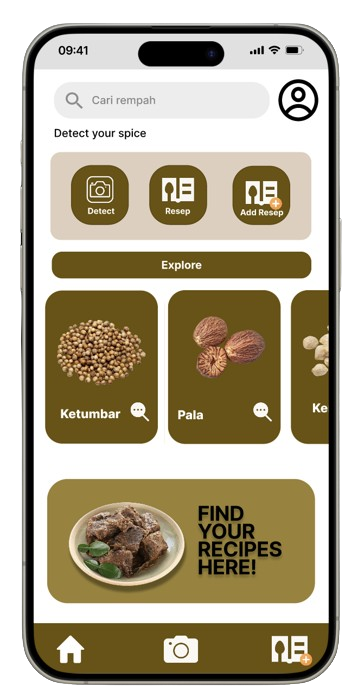

  # C241-PS204_spices_detection

  ## Team ID : C241-PS204

| Nama          | Student ID | Path              | LinkedIn                                      |
|---------------|------------|-------------------|-----------------------------------------------|
| Dwi Andhara Valkyrie      | M497D4KX3132  | Machine Learning  | [Dhara](https://www.linkedin.com/in/dwi-andhara-valkyrie/) |
| Priskila Christine Natalia Parapat    | M114D4KX2213  | Machine Learning| [Priskila](https://www.linkedin.com/in/priskilaparapat/) |
| Tubagus Aldi Maulana Yusuf    | M288D4KY2835  | Machine Learning| [Tubagus Aldi](http://www.linkedin.com/in/tubagusaldi) |
| Bagus Triyudanto    | C116D4KY0582  | Cloud Computing| [Bagus](https://www.linkedin.com/in/bagus-triyudanto-83a92b2a6/) |
| Firlan Syah    |  C288D4KY1151  | Cloud Computing| [Firlan Syah](https://www.linkedin.com/in/firlan-syah) |
| Alvito Reyhan Nugroho    | A009D4KY3464  | Mobile Development| [Alvito Reyhan N](https://www.linkedin.com/in/alvito-reyhan-nugroho-b36a62229/) |
| Machfud Ichsan Khoirudin    | A121D4KY3668  | Mobile Development| [Machfud Ichsan K](http://www.linkedin.com/in/machfudichsan) |

  ## About The Project
<!-- logo -->

  

Indonesia's rempah-rempah (spices) are the fragrant foundation of its world-renowned cuisine. As of May 2024, the nation's spice exports have reached a remarkable US$1.4 billion, a significant 12.5% increase compared to the previous year. This fragrant journey through time showcases Indonesia's enduring role as a key player in the global spice trade.Yet, identifying these spices can be a challenge due to their similar appearances. This confusion can limit exploration and appreciation of this rich culinary heritage.

Current methods of identifying rempah-rempah often rely on visual inspection, leading to misidentification and missed culinary opportunities. Inaccurate spice use can result in unintended flavors or even health risks.We propose a mobile app that leverages machine learning for object detection. Users simply point their smartphone camera at an unknown spice, and the app reveals its identity.  Following identification, the app unlocks a treasure trove of information, including origin, properties, health benefits, and traditional Indonesian culinary uses. To further inspire exploration, the app offers curated recipes featuring the identified spice.

<!-- display 1, 2, 3 -->

